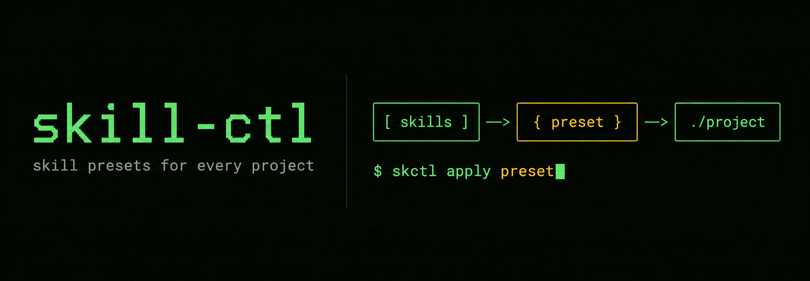

# skill-ctl (`skctl`)



**Store skills once. Use them where they fit.**

`skctl` groups AI agent skills into named presets and applies them to projects. It uses [`npx skills`](https://skills.sh) for installation and updates.

Use it to:

- Apply the same skill set to multiple projects.
- Search installed skills by name or description.
- Remove only the links created by a preset.
- Back up presets and restore them on another machine.
- Record a project's selected skills in `skills-applied.json`.

```text
              WITHOUT SKCTL

  Frontend App A             Frontend App B

  install React skills       install React skills
  install UI design          install UI design
  install accessibility      install accessibility
  install testing            install testing

  repeated setup ─────────────────────────▶


                WITH SKCTL

  [ react ] [ ui ] [ a11y ] [ testing ]
                    │
                    ▼
             ┌──────────────┐
             │   frontend   │
             │    preset    │
             └──────┬───────┘
                    │
        skctl apply frontend
              ┌─────┴─────┐
              ▼           ▼
      Frontend App A  Frontend App B

  improve the frontend preset once
                    │
                    ▼
  both linked apps use the updated skills
```

## Install

You need Python 3.10 or later and Node.js.

For interactive pickers and Markdown previews, install [`fzf`](https://github.com/junegunn/fzf) and [`bat`](https://github.com/sharkdp/bat). Without `fzf`, `skctl` falls back to numbered prompts; without `bat`, previews use plain `cat`.

```bash
git clone https://github.com/Hadisd/skill-ctl.git
cd skill-ctl
python3 -m pip install --user .
```

If you have [`uv`](https://docs.astral.sh/uv/) installed, use its isolated tool environment instead:

```bash
uv tool install .
```

`pipx install .` is another isolated-install option. If `skctl` is not found after the user install, add `~/.local/bin` to your `PATH`.

On Windows, run the same commands in PowerShell. If Windows blocks symlink creation, `skctl apply` copies the skill directories instead.

Install directly from GitHub instead of cloning first:

```bash
python3 -m pip install --user git+https://github.com/Hadisd/skill-ctl
```

With uv: `uv tool install git+https://github.com/Hadisd/skill-ctl`.

Check the installation:

```bash
skctl --help
```

If you installed the tool with `uv`, reinstall it after changing the source:

```bash
uv tool install --reinstall .
```

## Updating skctl itself

```bash
skctl self-update
skctl self-update --check
skctl self-update --yes
```

`skctl update` updates managed skills, while `skctl self-update` updates the CLI.

## Quick start

Add skills to a preset:

```bash
skctl add vercel-labs/agent-skills@vercel-optimize --preset
skctl add vercel-labs/agent-skills --skill web-design-guidelines -y --preset frontend
skctl add --preset frontend          # choose from installed skills
```

A bare `--preset` uses `default_preset` from `~/.skill-ctl/config.yaml`. Flags such as `-y` and `--agent` pass through to `npx skills`.

Apply skills from inside a project:

```bash
skctl apply                            # choose a preset and its skills
skctl apply my-preset                  # apply the whole preset
skctl apply frontend -s web-design-guidelines # apply selected skills without a prompt
skctl apply my-preset --pick           # choose skills in fzf
skctl apply my-preset --agent cursor
skctl apply my-preset --copy           # copy instead of linking
skctl apply my-preset --dry-run        # preview without changing the project
```

Remove applied skills:

```bash
skctl unapply my-preset
skctl unapply              # use the project record or the default preset
skctl rm                   # choose installed skills to remove
```

## Commands

| Command | Description |
|---|---|
| `skctl add [<pkg>] --preset [name]` | Add a package, or choose from installed skills |
| `skctl add <pkg> -p [path]` | Install directly into a project |
| `skctl add <pkg> -g` | Install globally |
| `skctl apply [preset]` | Choose interactively, or apply a named preset |
| `skctl apply [preset] -s a,b` | Apply named skills without prompting |
| `skctl apply [preset] --pick` | Choose skills in fzf |
| `skctl apply --all-presets` | Choose from every preset |
| `skctl apply --resync` | Reapply the skills recorded by the project |
| `skctl apply [preset] --npx` | Install through `npx skills` instead of linking |
| `skctl apply [preset] --dry-run` | Preview links, copies, replacements, and npx commands without writing |
| `skctl unapply [preset]` | Remove a preset's links from a project |
| `skctl presets` | Browse presets with fzf, or list them when fzf is unavailable. Tab selects; Alt-N creates, Alt-L clones, Alt-M combines, Alt-R renames, Alt-D deletes, and Alt-E exports. |
| `skctl presets list` | List presets, skill counts, and applied project counts |
| `skctl presets applied` | Show every project and the presets applied to it |
| `skctl presets rename <old> <new>` | Rename a preset and update project records |
| `skctl status [--project <path>]` | Show applied preset status for a project |
| `skctl presets create <name> [--from <path>]` | Create a preset, optionally copying direct skills from a path |
| `skctl presets clone <source> <name>` | Copy a preset into an independent new preset |
| `skctl presets combine <name> <preset> <preset> [...]` | Copy several presets' skills into one flat preset |
| `skctl presets history <name>` | Show a preset's clone or combine origin |
| `skctl presets delete <name>` | Delete a preset |
| `skctl presets export <name>` | Export one preset to a portable archive |
| `skctl presets import <archive>` | Preview and import a portable preset archive |
| `skctl list [--preset <name>\|-g]` | List project, preset, or global skills |
| `skctl search [query]` | Interactively search and apply preset and global skills |
| `skctl search [query] --preset <name>` | Search one preset |
| `skctl search [query] --global` | Search configured global folders |
| `skctl search [query] --applied` | Show skills available to the current project |
| `skctl search [query] --json` | Print full results as JSON |
| `skctl remove [skill] [--preset <name>]` | Remove a skill or open the removal picker |
| `skctl update [skill]` | Update project skills |
| `skctl update --preset <name>` | Update a preset |
| `skctl update --all` | Update every preset with source metadata |
| `skctl update -g` | Update global skills |
| `skctl self-update [--check\|--yes]` | Update the skctl CLI from its latest release |
| `skctl version` | Print the installed skctl version (also `--version`, `-V`) |
| `skctl doctor [--all] [--fix]` | Find or remove broken preset links |
| `skctl backup [push\|pull\|status]` | Manage preset backups |
| `skctl config [show\|path\|edit\|reset]` | Manage configuration |
| `skctl completion fish\|bash\|zsh\|powershell` | Print shell completion code |

Aliases: `preset` means `presets`, `rm` means `remove`, `sync` means `backup`, and `restore` means `backup pull`.

## Preset storage

Each preset is a `skills.sh` workspace under `~/.skill-ctl/presets/`:

```text
~/.skill-ctl/presets/
├── default/
│   ├── skills-lock.json
│   └── .agents/skills/
└── my-preset/
    ├── skills-lock.json
    └── .agents/skills/
```

Clone a preset to make an independent starting point, or combine several
presets into one flat skill bundle. Combining keeps the first selected version
when skill names overlap; an interactive terminal lets you choose instead.

```bash
skctl presets clone frontend frontend-next
skctl presets combine dev frontend backend testing --dry-run
skctl presets combine dev frontend backend testing
skctl presets history dev
skctl presets create project-skills --from .
```

`create --from` copies direct skill folders containing `SKILL.md`. Point it at a
skill root, an agent directory such as `.agents`, or a project root; project
roots scan `.agents/skills` and `.claude/skills`. Sources are never moved or
linked.

Run `skctl` without a subcommand to see the storage path, preset count, and a short command guide.

## Configuration

Open the configuration file with:

```bash
skctl config edit
```

Common settings:

```yaml
default_destination: prompt
default_preset: default

apply_targets:
  - ".agents/skills"
  - ".claude/skills"

apply_mode: symlink
default_agents: []

prompts:
  ask_destination: true
  ask_apply: true
  picker: auto
  preset_picker_threshold: 10
  ask_add_after_create: true

global_skill_dirs:
  # Add custom shared-skill folders here, for example "~/skill-share".
  - "~/.agents/skills"
  - "~/.claude/skills"
  - "~/.codex/skills"
  - "~/.cursor/skills"
  - "~/.codeium/windsurf/skills"

custom_agents: {}

backup:
  auto_push: false

npx:
  patch_scope_prompt: true
```

`global_skill_dirs` controls which global folders appear in search results and the preset creation picker. You may add absolute paths or paths beginning with `~`. Missing folders are ignored.

## Search

`skctl find` searches skills.sh with skctl's own fzf picker: up to 50 live results, installs count, and a preview panel with GitHub stars and SKILL.md content, Tab to select several at once. Pass `--npx` to use `npx skills`' own interactive finder instead. `skctl search` searches skills already stored in presets or configured global folders.

```bash
skctl find                            # skctl's fzf picker, live results
skctl find typescript                 # start the picker with a query
skctl find --preset frontend          # choose interactively, then install into a preset
skctl find react -P frontend          # search and install into a preset
skctl find --npx                      # npx skills' own interactive finder
skctl find react --npx -P frontend    # npx skills' finder, started with a query
skctl search latex                   # opens fzf with “latex” entered
skctl search ltxpap                  # fzf fuzzy-match for latex-paper
skctl search diagrams --preset work
skctl search --global
skctl search --applied
skctl search bibliography --json
```

Every word in the query must match either the skill name or its description. Names support substring and subsequence matching. Descriptions support substring matching only. Exact name matches rank before fuzzy name matches and description matches.

The table marks project skills with `✓` and labels global skills as `global`. A skill without readable frontmatter remains searchable by its folder name.

`skctl search` always opens fzf. A query is entered into fzf for you, so you can refine it or clear it to browse everything. `--json` prints the matching records instead.

### fzf picker

Use `--pick` or `-i` to open fzf. The controls are:

- Type to filter.
- Press `Tab` to select multiple skills.
- Press `ctrl-a` to select every visible result.
- Press `ctrl-d` to clear the selection.
- Press `Enter` to apply the selection.
- Press `Esc` to cancel.

The preview pane displays `SKILL.md`. It uses `bat`, `batcat`, `glow`, or `cat`, in that order. The `bat` preview wraps to the pane width and collapses repeated blank lines.

The location column is dim magenta. Descriptions are dim. Selecting a global result does not apply it again because it is already available globally.

In `skctl find`, Alt-A opens `npx skills`' picker for the highlighted repository. Alt-C replaces the search query with that repository name.

Without fzf, `skctl` uses a numbered prompt. Set the picker explicitly if needed:

```yaml
prompts:
  picker: auto     # use fzf when available on a terminal
  # picker: fzf
  # picker: numbers
```

## Creating presets from installed skills

After `skctl presets create <name>`, clone, or combine, an interactive terminal asks what to do next:

```text
1) Pick from installed presets or global folders
2) Find on skills.sh
3) No, Done
```

In a script or non-interactive terminal, it creates the preset without asking.

Skills copied from another preset remain independent of that preset. Global skills recorded in `~/.agents/.skill-lock.json` are reinstalled through `npx skills`, which writes update metadata into the new preset. Skills without global update metadata are copied, and `skctl` prints a warning.

Use the same picker with an existing preset:

```bash
skctl add --preset frontend
```

The picker excludes skills already present in the target preset.

## Hand-authored presets

A preset may contain your own skills directly. Each skill needs a `SKILL.md`; no `.agents`, `.claude`, or `skills-lock.json` file is required.

```text
~/.skill-ctl/presets/my-skills/
  frontend-helper/
    SKILL.md
  release-checklist/
    SKILL.md
```

`skctl apply my-skills` links these folders into the project's configured agent targets. `skills-lock.json` is only needed for skills installed through `npx skills` and later updates.

## Applying presets

The default mode creates symlinks. Projects then receive preset updates without another apply operation.

`--copy` creates independent directories. Use `--force` to replace an existing directory that the preset does not own. Without `--force`, `apply` preserves real files and directories.

Use `--dry-run` before applying when you want to inspect the planned links,
copies, replacements, or protected existing directories. It does not create
project files, update records, or run `npx skills`.

`--npx` delegates installation and skill selection to `npx skills`. It writes `skills-lock.json` and copies the selected skills. After installation, `skctl` records the directories and skills that appeared.

When `npx skills` installs into an unknown agent directory such as `.goose/skills`, `skctl` discovers that directory before recording the result.

## Project records

`apply` writes `skills-applied.json` in the project:

```json
{
  "version": 1,
  "presets": {
    "latex-paper": {
      "mode": "symlink",
      "skills": ["drawio", "latex-paper-en"],
      "targets": [".agents/skills", ".claude/skills"]
    }
  }
}
```

Commit this file if teammates should reproduce the same selection. They can run:

```bash
skctl apply --resync
```

The project record is separate from `skills-lock.json`. The upstream file stores package sources. The `skctl` record stores the preset name, selected skills, target directories, and installation mode.

Repeated applications merge their skill and target lists. If an operation cannot place a skill, the record does not claim it. An incomplete `unapply` keeps the names of any copies or unrelated directories left in place.

`skctl` also indexes project records in `~/.skill-ctl/applied.json`. This index lets `doctor --all` and `presets delete` find affected projects. A cloned project adds itself to the index the first time `skctl` reads its record.

## Removing presets

`unapply` removes symlinks that point into the selected preset. It leaves same-named skills installed by another method. Pass `--force` to remove copied directories.

Without `--agent`, `unapply` checks every known agent directory, directories discovered in the project, and directories stored in the project record. It removes empty agent directories and stale entries from `skills-lock.json`.

Deleting a preset may leave dangling links in projects that use it. `presets delete` lists affected projects. Clean them with:

```bash
skctl doctor --all --fix
```

Copied skills require `skctl unapply <preset> --force` because they are directories rather than links.

To remove skills from the preset itself, omit the skill name to open fzf:

```bash
skctl remove --preset frontend
skctl remove web-design-guidelines --preset frontend
```

The interactive command asks for confirmation after selection. Pass `-y` to skip it.

## Updating skills

```bash
skctl update
skctl update tdd
skctl update --preset frontend
skctl update --all
skctl update -g
```

A preset needs `skills-lock.json` before it can update. `--all` skips older presets without one and names them in its output. Re-add old preset skills through `skctl add <pkg> --preset <name>` if the lock file is missing.

## Backups

`skctl backup` stores `~/.skill-ctl`'s preset files in a Git repository. `config.yaml` (per-machine preferences) and `applied.json` (this machine's absolute project paths) stay local, since restoring them on another machine would fight its own setup. Pass `--config` to `skctl backup push` to include `config.yaml` anyway; `applied.json` never syncs.

Initialize a backup:

```bash
skctl backup init --repo <owner/name>
```

Use an existing repository URL, or pass a bare name and let the `gh` CLI create a private repository.

```bash
skctl backup
skctl backup -m "add latex preset"
skctl backup status
```

Restore on another machine:

```bash
skctl restore --repo <owner/name>
```

The backup contains skill files, not only lock files. Anyone with access to the repository can read those skills. Keep the repository private if the skills are private.

Preview a restore before it writes files:

```bash
skctl backup pull --dry-run
```

If a push is rejected because the remote has commits from another machine you don't have locally, `skctl backup pull` is the usual fix. When this machine's presets are the ones you actually want to keep, force-push over the remote instead:

```bash
skctl backup push --force
```

`backup pull` replaces a fresh local `~/.skill-ctl` after confirmation. It stops if the local repository has commits missing from the remote.

## Sharing one preset

Exporting writes the preset's files, `skills-lock.json`, and a manifest with its skill list and source metadata. Imports always show their file changes first. An existing preset needs `--replace`, or `--rename` to keep both copies.

```bash
skctl presets export frontend --output frontend.skctl-preset.zip
skctl presets import frontend.skctl-preset.zip --dry-run
skctl presets import frontend.skctl-preset.zip --rename frontend-copy
```

Enable automatic pushes after commands that change a preset:

```yaml
backup:
  auto_push: true
```

A failed automatic push prints a warning and does not undo the local command.

## Shell completion

Generate completion code for fish:

```fish
skctl completion fish > ~/.config/fish/completions/skctl.fish
```

Bash writes to `~/.local/share/bash-completion/completions/skctl`. Zsh uses a `_skctl` file on `$fpath`.
Preset names complete after `--preset` or `-P`, including `skctl add --preset <Tab>`.

For PowerShell, add the generated script to your profile:

```powershell
skctl completion powershell >> $PROFILE
```

Completions read preset names from `~/.skill-ctl/presets`, so new presets appear without regenerating the script.

## Upstream scope prompt

`npx skills add` may ask for project or global scope after `skctl` already passed `-p`. By default, a Node loader patches that check while the upstream module loads.

If the upstream source changes and the patch no longer matches, `npx skills` runs unchanged and shows its scope prompt. Disable the patch with:

```yaml
npx:
  patch_scope_prompt: false
```

## Skill safety

> [!WARNING]
> Skills run with the agent's permissions. Read `SKILL.md` and inspect included scripts before installation. Check the package source before using `-y` or `--all`. Use `--copy` if you do not want a symlink to follow later source changes.

`skctl` manages skill locations and preset membership. It does not inspect skills for malicious or unsafe instructions.
